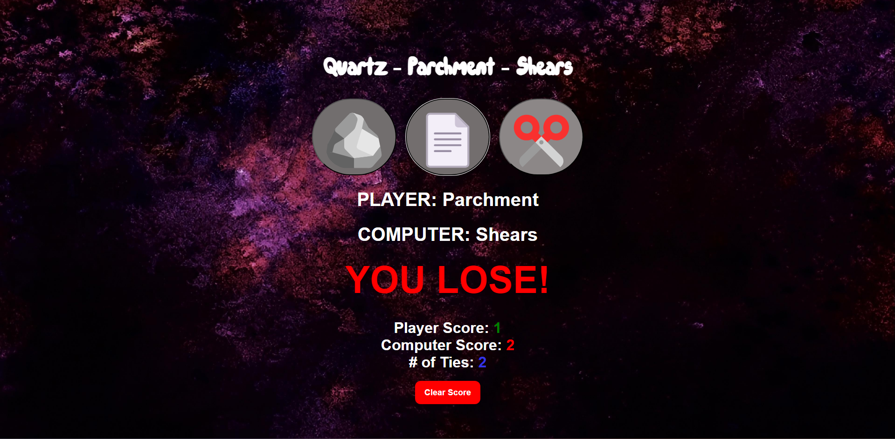

# Quartz Parchment Shears

"Oh-ho-ho, I adore Rock Paper Scissors! Although, where I've come from, we call it 'Quartz Parchment Shears.'" - Pops

Rock Paper Scissors is the game that we all know and love. Its rules are simple, easy to play, and require two players. This repository contains the code for this same game written with vanilla HTML, CSS, and JS. Instead of two human players playing against each other, the game is played with the user and a computer. The web app will track the number of wins, losses, and ties for each player and save them to local storage. It also features the ability for the user to clear the scores and start over. The name and font of the game are inspired by the "Regular Show" episode called "First Day," in which the two protoganists play Rock Paper Scissors to decide who gets an old couch. The background image of this web app is also from Regular Show.

## Features

- **Regular-Show Inspired Styles**: The font for the title and background image is inspired by what is used in the Regular Show's title card that appears at the beginning of every episode.
- **Score Tracking**: The number of wins, losses, and ties for each player is tracked and saved to local storage.
- **Responsive Design**: The web app is responsive and will adjust to any screen size, up to the smallest smartphones.
- **Clear Scores**: The user can clear the scores and start over.

## Important Files

- `index.html`: The main HTML file that contains the buttons the user needs to press to make their choice, the current choice of the user and the computer, the score display, and the clear button.
- `style.css`: The CSS file that contains the styling for the web app including media queries for responsiveness.
- `index.js`: The JavaScript file that contains the logic for the game, including the logic for the computer's choice and the logic for the user's choice.
- `icon.png`: The icon for the web app.

## How to Run

1. Download or clone the files from this repository.
2. Open `index.html` in your web browser.
3. Play the game!

## Credits

This game was inspired by Regular Show and the original game of Rock Paper Scissors.